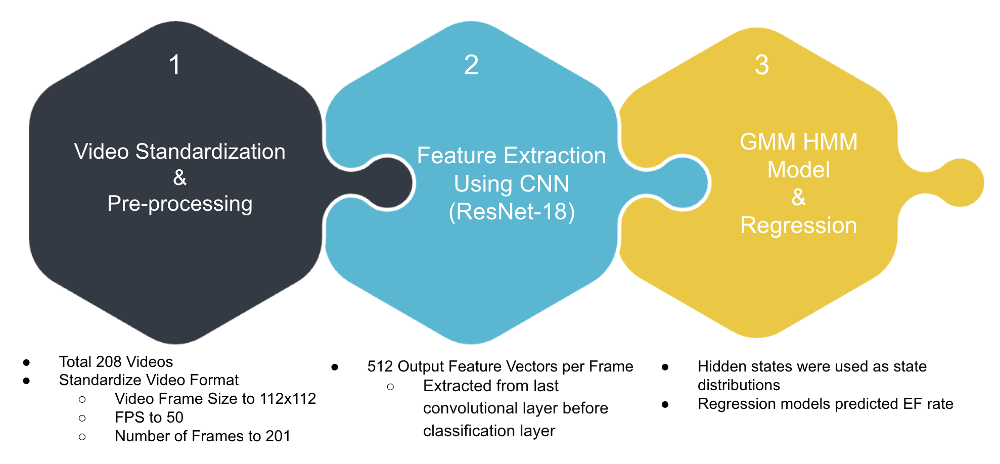

# **Bayesian Heart Rate Prediction**
---
## **Problem Statement & Motivation**

---
## **Data Set**

---
## **Model Pipeline**

---
## **Result / Summary**

---
## **Next Steps / Future Improvements**
While our current model provides an approach to estimating ejection fraction (EF) using machine learning techniques, there are several areas for improvement and future directions.

## **1. Improving Feature Extraction**
The choice of **ResNet18** for feature extraction prioritized texture-based patterns such as **edges, curves, and gradients**. However, this may not fully capture the **temporal dynamics** of the left ventricle’s motion. To improve this:  

### **Alternative Deep Learning Models:**
- **Echonet**: A deep learning model specifically designed for echocardiography, trained on large-scale EF datasets.
- **Lidar3DCNN**: A 3D convolutional model that could capture volumetric changes more effectively.
- **TimeSformer**: A transformer-based architecture that models spatial and temporal dependencies better than CNNs.

## **2. Refining State Modeling (Beyond GMM-HMM)**
Our current pipeline applies **Gaussian Mixture Models (GMM) + Hidden Markov Models (HMM)** to model state transitions. However, several enhancements could be explored:

### **Alternative State Modeling Techniques:**
- **Deep Hidden Markov Models (DeepHMM)**: Uses neural networks to model latent state transitions more effectively.
- **Recurrent Neural Networks (RNNs) or LSTMs**: Can learn **temporal dependencies** in EF progression without requiring discrete states.
- **Transformer-based Sequence Models**: Could improve performance by better handling long-term dependencies.

### **Adaptive State Learning**
- Instead of **predefining the number of states**, use a **data-driven approach** to learn the **optimal number of EF states dynamically**.
- Why Avoid Predefining States?
    - Cardiac motion is complex and varies across patients, meaning that a fixed number of states may oversimplify or overcomplicate the EF estimation process.
    - Different patients have different ventricular motion characteristics.
    - Due to iime-dependent changes in EF, using a fixed number of states may fail to capture gradual changes in EF dynamics.

